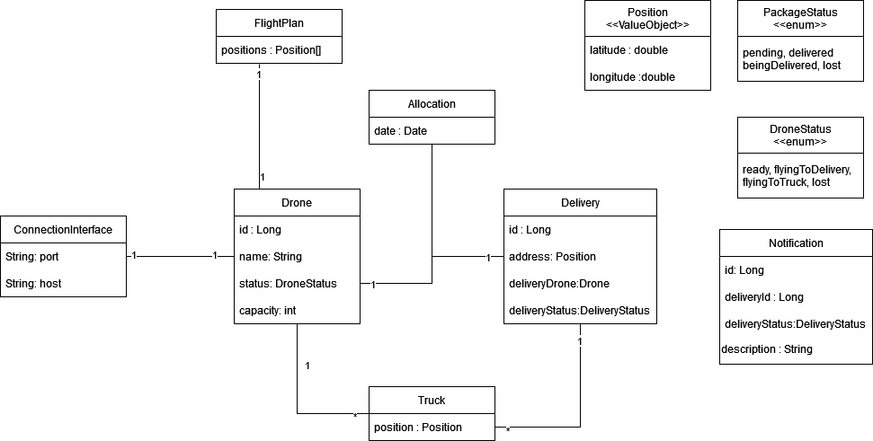
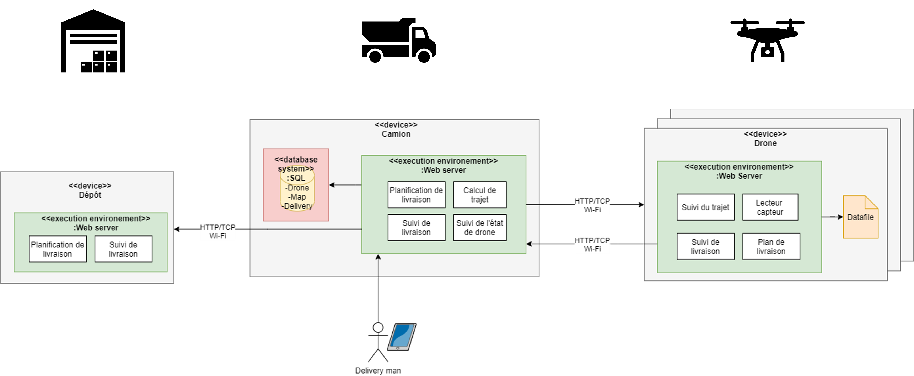

<br />
<p align="center">
  <h3 align="center">AL Drone Delivery</h3>

  <p align="center">
  Team G - Variant V3
   <br /><br />
   <a href="https://github.com/Martin-Bruel">Bruel Martin</a>,
   <a href="https://github.com/Thibaut-Esteve">Esteve Thibaut</a>,
   <a href="https://github.com/DavidLebrisse">Lebrisse David</a>,
   <a href="https://github.com/NathanMeulle">Meulle Nathan</a>,	
   <a href="https://github.com/kevinushaka">Ushaka Kevin</a>,
   <br /><br />
   
  </p>
  <p align="center">
</p>

## Sommaire

* [A propos du projet](#a-propos-du-projet)
* [Installation](#installation)
  * [Prérequis](#prérequis)
  * [Compilation](#compilation)
* [Commandes](#commandes)
  * [Ajout de colis](#ajout-de-colis)
  * [Allocation des colis](#allocation-des-colis)
  * [Lance une livraison](#lance-une-livraison)
* [Architecture](#architecture)
  * [Diagramme classe](#diagramme-classe)
  * [Diagramme architecure](#diagramme-architecture)
 

## A propos du projet
Simulartion de livraison de colis par drone depuis un camion

## Installation

### Prérequis  

- git              
*sudo apt-get install git*  

- python3  
*sudo apt-get install python3*  
*sudo apt-get install pip3*    
*sudo apt install python-is-python3*  

- java 11  
*sudo apt-get install openjdk-11-jdk*  

- maven  
*sudo apt-get install maven*  

- docker  
*sudo apt-get install docker*  
https://docs.docker.com/compose/install/  
https://docs.docker.com/engine/install/linux-postinstall/  

### Compilation

```
./prepare.sh
cd docker
./logs.sh
```

## Commandes

Il existe 3 entités :  
truck : le camion - il est alloue des colis à des drones et assure la disponibilité des drones  
drone : les drones - ils livrent les colis aux positions données par le camion  
warehouse : dépôt - il recoit les notification lors des livraison de colis  

Au départ, le camion pocède 3 drone (alpha, beta, charly) et aucun clois.  
Les commandes suivante réalise un scénarion classique de livraison  

### Ajout de colis

Ajoute des colis dans le camions  
Les colis livrés doivent être dans un rayon de 50 autours du camion

POST http://localhost:8085/package/add  
body : 
```
{
    "latitude":number,
    "longitude":number
}
```  
response : 200 OK

### Allocation des colis

Associe un drone avec un colis

GET http://localhost:8085/truck/allocation  
body :  
response : 200 OK  
```
[
    {
        "droneId": number,
        "deliveryIds": [
            number
        ]
    }
]
```

### Lance une livraison

Commence la livraison d'un drone pour un colis donné  
Le drone et le colis doivent exister dans le camion  
Le id du drone est passé en paramètre dans la requète HTTP  
Le id du colis est passé dans le body de la requète  

POST http://localhost:8085/start/drone/<droneID: number>  
body :  
```
[
    number
]
```  
response : 200 OK  

## Architecture

### Diagramme classe



### Diagramme architecture


